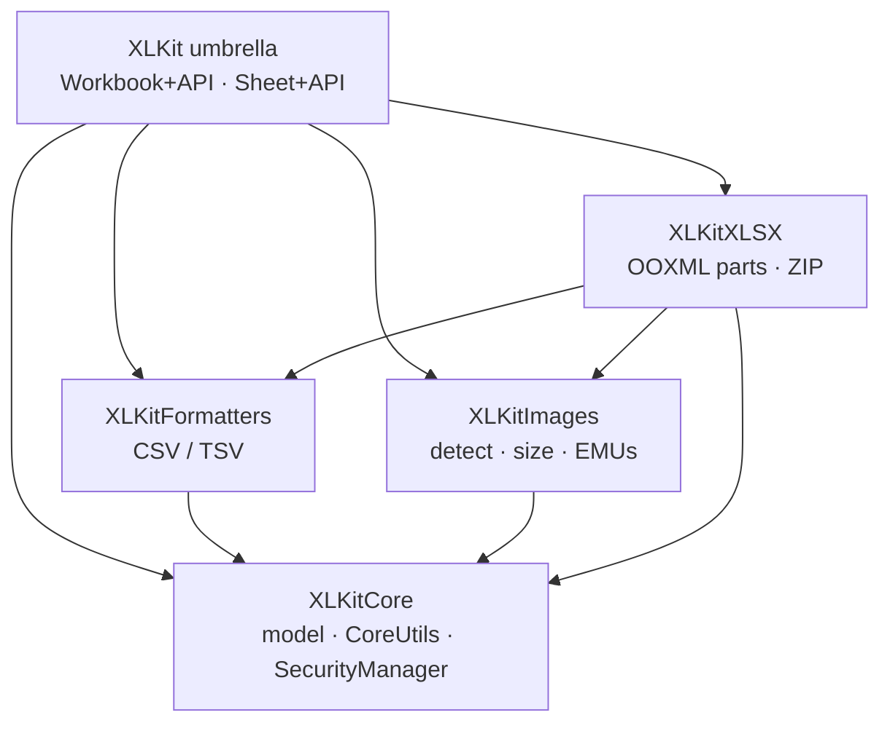
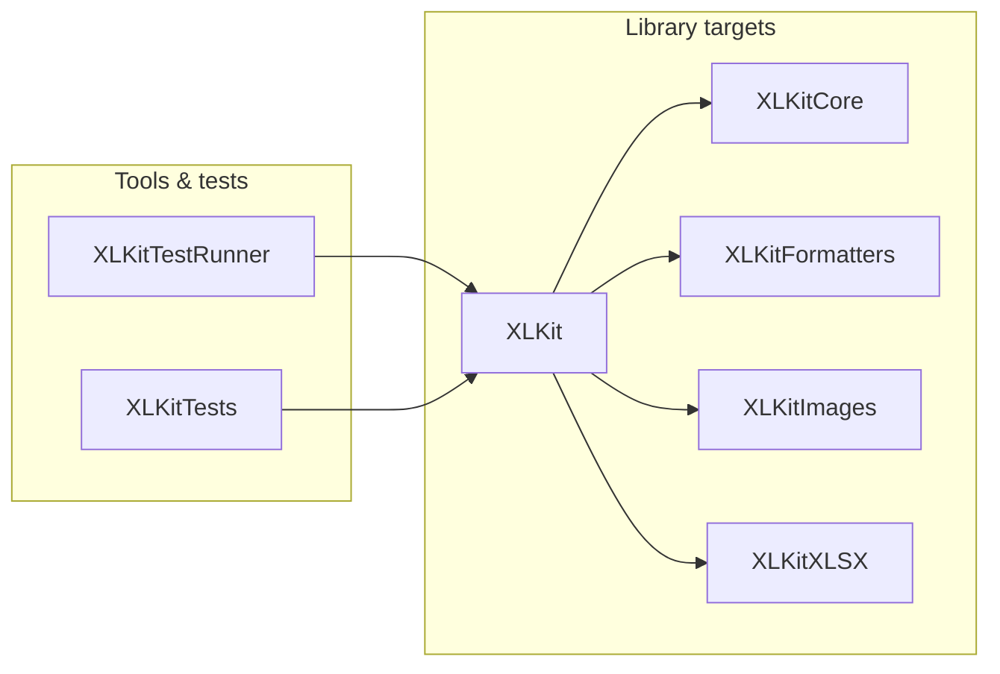

# XLKit — Architecture & Conventions

A guide for contributors: project structure, architecture, naming, styling, and design decisions.

**See also:** [GUARDRAILS.md](GUARDRAILS.md) (must / must-not), [.cursorrules](.cursorrules), [AGENT.MD](AGENT.MD), [Tests/README.md](Tests/README.md), [Documentation/Manual/02-Architecture-Modules-and-Source-Map.md](Documentation/Manual/02-Architecture-Modules-and-Source-Map.md).

---

## 1. Project overview

XLKit is a **Swift 6** library for creating Excel **`.xlsx`** workbooks (Office Open XML) on **macOS 12+** and **iOS 15+**. It exposes a fluent in-memory model (`Workbook` / `Sheet`), CSV/TSV helpers, pixel-perfect image embedding, cell formatting, sheet visibility/protection, and ZIP-based XLSX generation.

- **Package:** `XLKit` (`swift-tools-version: 6.0`)
- **Library products:** `XLKit` (umbrella), `XLKitCore`, `XLKitFormatters`, `XLKitImages`, `XLKitXLSX`
- **Executable:** `XLKitTestRunner` (demos + CoreXLSX validation; not part of the library product)
- **Platforms:** macOS 12+, iOS 15+
- **Repository:** https://github.com/TheAcharya/XLKit
- **Library dependencies:** ZIPFoundation (XLSX zip), swift-textfile / TextFile (CSV/TSV). **CoreXLSX** is linked only by `XLKitTestRunner` for validation.
- **Tests:** **80** Swift Testing tests in `XLKitTests` (15 `@Suite`s + `XLKitTestSupport` helpers). See [Tests/README.md](Tests/README.md).

---

## 2. Architecture

### 2.1 Modular SPM stack

App code should normally depend on the **`XLKit`** umbrella (re-exports all modules). Advanced consumers may depend on a subset.

```text
XLKit (umbrella, @_exported imports)
├── XLKitCore       — Workbook, Sheet, types, CoreUtils, SecurityManager
├── XLKitFormatters — CSVUtils (swift-textfile)
├── XLKitImages     — ImageUtils, ImageSizingUtils
└── XLKitXLSX       — XLSXEngine (ZIPFoundation)

XLKitFormatters → XLKitCore + TextFile
XLKitImages     → XLKitCore
XLKitXLSX       → XLKitCore + XLKitFormatters + XLKitImages + ZIPFoundation
```



| Module | Responsibility |
|--------|----------------|
| **XLKitCore** | Domain model: `Workbook`, `Sheet`, `CellValue`, `Cell`, `CellFormat`, `SheetState`, `SheetProtection`, coordinates, `ExcelImage`, `XLKitError`, `CoreUtils`, `SecurityManager`. |
| **XLKitFormatters** | `CSVUtils` — CSV and TSV only (no custom delimiters), via swift-textfile. |
| **XLKitImages** | Format detection, dimensions, `ExcelImage` construction; **ImageSizingUtils** (aspect fit, EMUs, Excel col/row formulas). |
| **XLKitXLSX** | `XLSXEngine` — styles, shared strings, worksheets, drawings, relationships, ZIP. |
| **XLKit** | Re-exports; `Workbook+API` / `Sheet+API` (save, CSV, image embed). |

The `XLKit` **struct** in `XLKit.swift` is an empty namespace; behaviour lives on `Workbook` / `Sheet` or static helpers.

### 2.2 Where to put a change

Extend **bottom-up**. Do not invent OOXML or sizing rules only in the TestRunner.

| Change type | Put it in |
|-------------|-----------|
| New cell / sheet / workbook model field | **XLKitCore** |
| Password / date / column-letter helpers | **CoreUtils** (`XLKitCore`) |
| CSV/TSV parsing behaviour | **XLKitFormatters** |
| Image format / pixel size / display size | **XLKitImages** |
| Worksheet/workbook/drawing XML or ZIP layout | **XLKitXLSX** |
| Fluent convenience that wraps existing modules | **XLKit** (`*+API.swift`) |
| Demo CLI / CoreXLSX validation | **XLKitTestRunner** only |
| Demo-only salts / passwords | `ComprehensiveDemoProtection.swift` (TestRunner — **not** public CoreUtils) |

### 2.3 Save pipeline

```text
In-memory Workbook
    → workbook.save(to:)  [@MainActor]
    → SecurityManager (rate limit, optional path rules)
    → XLSXEngine.generateXLSX
        → temp OOXML tree (content types, docProps, theme, styles, sharedStrings,
           workbook, worksheets, media, drawings, relationships)
        → ZIPFoundation archive → .xlsx
    → optional SHA-256 checksum sidecar
```

Workbook XML may emit sheet `state` and `activeTab` when needed. Worksheet XML may emit `<sheetProtection>` after `</sheetData>`. Visible / unprotected sheets stay free of extra attributes (backward-compatible).

App code should use **`save(to:)`**. `XLSXEngine.generateXLSX` / `formatToKey` are for engine and tests.

### 2.4 Image embedding & sizing (critical)

Pixel-perfect aspect ratio preservation is a **core product invariant**.

| Rule | Formula / behaviour |
|------|---------------------|
| Column width | `pixels / 8.0` |
| Row height | `pixels / 1.33` |
| EMUs | `1 pixel = 9525 EMUs` |
| Drawing | Prefer `rowOff = 0`; use **ImageSizingUtils** — never hardcode dimensions |
| Defaults | `maxCellWidth: 600`, `maxCellHeight: 400`, `scale: 0.5` |

Prefer `embedImageAutoSized` / `embedImage` on `Sheet` after column layout; let XLKit size the image column.

### 2.5 Concurrency & Sendable

- **`Workbook` and `Sheet` are not Sendable** (mutable reference types). Do not mark them Sendable.
- File I/O, security, and image helpers that touch shared security state are **`@MainActor`** (`save`, `XLSXEngine.generateXLSX`, `SecurityManager`, `ImageUtils`, embed APIs).
- Async `save` exists for API ergonomics; implementation remains synchronous on the main actor because the model is not Sendable.
- Prefer `@preconcurrency import XLKitCore` from dependent modules when bridging Sendable boundaries.
- CI includes a **macOS (strict concurrency)** job with `SWIFT_STRICT_CONCURRENCY=complete`.

### 2.6 Error handling

- Public failures use **`XLKitError`** (`LocalizedError`).
- Prefer `guard` + early return; avoid force-unwrap / force-cast in public APIs.
- Security failures must not leak sensitive path or content details to end users; log via `SecurityManager` when appropriate.

### 2.7 Security integration

`SecurityManager` (@MainActor) provides rate limiting (100 ops/min), structured logging, optional quarantine heuristics for image data, optional checksum storage (off by default), and optional file-path restrictions (off by default). Wired into XLSX generation and image creation paths. See [SECURITY.md](SECURITY.md) and Manual chapter 08.

---

## 3. Codebase map

### 3.1 Source layout



| Path | Role |
|------|------|
| `Package.swift` | Targets, platforms, SPM deps |
| `Sources/XLKit/` | Umbrella + API extensions |
| `Sources/XLKitCore/` | Model + security + CoreUtils |
| `Sources/XLKitFormatters/` | CSV/TSV |
| `Sources/XLKitImages/` | Images + sizing |
| `Sources/XLKitXLSX/` | XLSX engine |
| `Sources/XLKitTestRunner/` | CLI generators + CoreXLSX checks |
| `Tests/XLKitTests/` | Swift Testing suites |
| `Test-Data/` | CLI fixtures (e.g. Embed-Test) |
| `Test-Workflows/` | Generated demo `.xlsx` outputs |
| `Documentation/Manual/` | User manual chapters |

### 3.2 Public surface (mental model)

- **Workbook** — sheets + workbook-level images; `save`, CSV/TSV convenience.
- **Sheet** — cells, formats, merges, sizes, per-sheet images, `state`, `protection`.
- **CellValue / Cell / CellFormat** — values and styling.
- **SheetState / SheetProtection** — tab visibility and Protect Sheet.
- **CoreUtils** — column letters, Excel dates, XML escape, sheet password hashes, path/size validation.
- **CSVUtils / ImageUtils / ImageSizingUtils / XLSXEngine** — module-level utilities (re-exported via XLKit).

Full tables: [Manual 12 — Complete API Reference](Documentation/Manual/12-Complete-API-Reference.md).

---

## 4. Naming conventions

### 4.1 Swift identifiers

- **Types:** PascalCase (`Workbook`, `SheetProtection`, `XLSXEngine`).
- **Methods / properties:** camelCase; fluent APIs return `Self` with `@discardableResult` where chaining is intended.
- Prefer enums over stringly-typed constants for public options (`BorderStyle`, `HorizontalAlignment`, …).

### 4.2 Files

- PascalCase `.swift` names matching the primary type or concern.
- TestRunner CLI command types: kebab-case in `main.swift` (`no-embeds`, `sheet-password`).
- Unit test suites: `*Tests.swift` with `@Suite` matching the feature area.

### 4.3 Product identity

- Use **XLKit** naming in code, comments, CLI output, and logs.
- Do not introduce alternate product / fork names in symbols or package products.

---

## 5. Code style & file header

### 5.1 Swift style

- Swift 6.0; 4-space indentation; trailing commas; alphabetical import groups; `MARK:` sections.
- Follow [Swift API Design Guidelines](https://swift.org/documentation/api-design-guidelines/) and project **`.swift-format`**.
- Public APIs: doc comments (`///`), parameters, errors, examples where helpful.
- Avoid force-unwraps and force-casts in public APIs.

### 5.2 File header (required for new Swift files)

```swift
//
//  FileName.swift
//  XLKit • https://github.com/TheAcharya/XLKit
//  © 2025 Vigneswaran Rajkumar • Licensed under MIT License
//

import Foundation
```

- Replace `FileName.swift` with the actual name.
- Do **not** add `Created by` or extra copyright lines.

### 5.3 Documentation

- User-facing behaviour → `Documentation/Manual/` (esp. chapters 03, 06, 09, 10, 12).
- Structural boundaries → this file.
- Hard constraints → [GUARDRAILS.md](GUARDRAILS.md).
- Agent briefing → [AGENT.MD](AGENT.MD) and [.cursorrules](.cursorrules) (keep those two in sync).

---

## 6. Design decisions

- **Write-oriented library** — XLKit generates `.xlsx`; it is not a full spreadsheet editor or `.numbers` exporter.
- **Instance APIs on Workbook/Sheet** — prefer fluent instance methods over free functions for CSV and cells.
- **CSV/TSV only** — no custom delimiters; avoids delimiter-vs-content collisions.
- **Image formats** — GIF, PNG, JPEG/JPG (BMP/TIFF removed for compatibility).
- **Column order** — worksheet cells sorted by numeric column index (A…Z, AA…) so Excel does not repair files.
- **Sheet protection passwords** — use `CoreUtils.excelLegacySheetPasswordHash` / `excelModernSheetPasswordHash` / `configureSheetPassword`. The OOXML-documented legacy formula is **incorrect**; XLKit matches Excel / LibreOffice / Excelize.
- **Demo constants** — comprehensive-demo password **1234** and salts live only in TestRunner (`ComprehensiveDemoProtection.swift`).
- **CoreXLSX** — validation dependency for TestRunner/CI demos, not the library product.
- **iOS** — avoid `homeDirectoryForCurrentUser`; use `#if os(macOS)` / documents & caches on iOS; CI builds and tests iOS.

---

## 7. XLKitTestRunner (CLI)

Binary: **`XLKitTestRunner`**. Commands include `no-embeds`, `embed`, `comprehensive` / `demo`, `number-formats`, `ios-test`, `security-demo`, `sheet-password`, `help`.

Outputs land under **`Test-Workflows/`** (and `iOS-Example.xlsx` at repo root for `ios-test`). See [Sources/XLKitTestRunner/README.md](Sources/XLKitTestRunner/README.md) and [Test-Workflows/README.md](Test-Workflows/README.md).

Adding a command: copy `Templates/TestGeneratorTemplate.swift`, register in `main.swift`, update help + Test-Workflows README.

---

## 8. Testing & CI

| Layer | Role |
|-------|------|
| **`swift test` / `XLKitTests`** | Swift Testing — public API coverage (80 tests) |
| **`XLKitTestRunner`** | Generated workbooks + CoreXLSX smoke |
| **`build.yml`** | macOS build/test + TestRunner smoke; **strict concurrency** job; iOS simulator build/test |
| **CLI workflows** | embed, no-embeds, comprehensive, ios, numbers |

Shared helpers: **`XLKitTestSupport`** in `Tests/XLKitTests/XLKitTestBase.swift` (not an XCTestCase).

---

## 9. References

- **Internal:** [GUARDRAILS.md](GUARDRAILS.md), [AGENT.MD](AGENT.MD), [.cursorrules](.cursorrules), [Tests/README.md](Tests/README.md), [Documentation/Manual/README.md](Documentation/Manual/README.md), [SECURITY.md](SECURITY.md), [CHANGELOG.md](CHANGELOG.md).
- **External:** [Office Open XML](https://learn.microsoft.com/en-us/office/open-xml/open-xml-sdk), [Swift API Design Guidelines](https://swift.org/documentation/api-design-guidelines/), [Swift Testing](https://developer.apple.com/xcode/swift-testing/), [ZIPFoundation](https://github.com/weichsel/ZIPFoundation), [swift-textfile](https://github.com/orchetect/swift-textfile), [CoreXLSX](https://github.com/CoreOffice/CoreXLSX).
